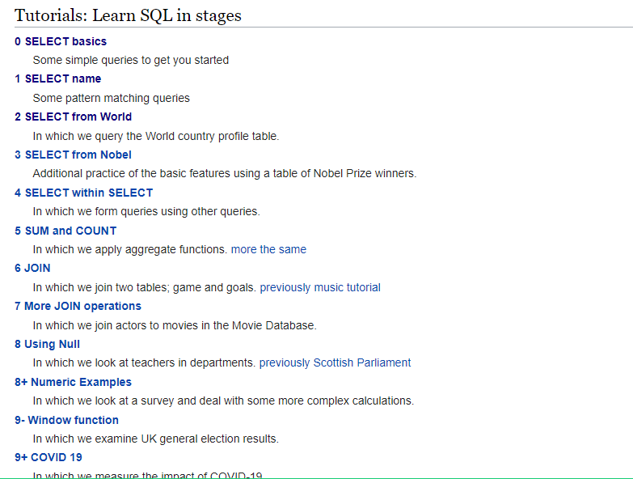

# SQL-ZOO

# About 

This project was built to test my domain of SQL queries by requesting me to retrieve and organize different pieces of data from a table.

# Author

👤 **Elijah Ayandokun**

- Github: [@elijahtobs](https://github.com/ElijahTobs)
- Twitter: [@elijahgr8](https://twitter.com/Elijahgr8)
- Linkedin: [ayandokunelijah](https://linkedin.com/in/ayandokunelijah)

## 🤝 Contributing

Contributions, issues and feature requests are welcome!

## Show your support

Give a ⭐️ if you like this project!

## Acknowledgments

- Project inspired by [Microverse](https://www.microverse.org)
- Project from [SQL ZOO](sqlzoo.net/wiki/SQL_Tutorial)
- Thanks to [The Odin Project (TOP)](theodinproject.com)
